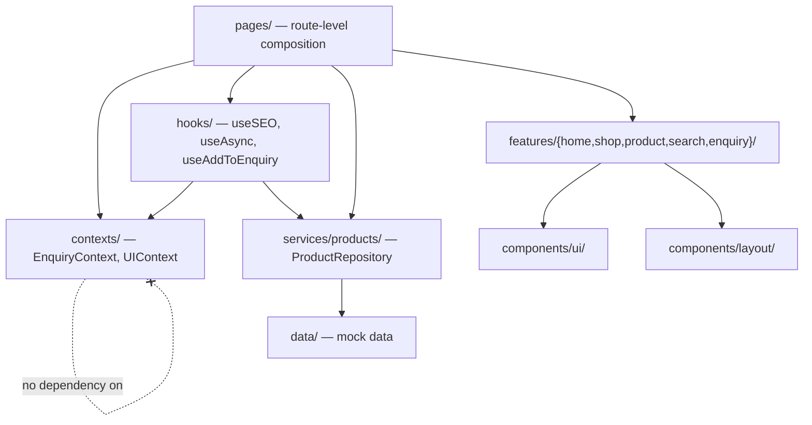
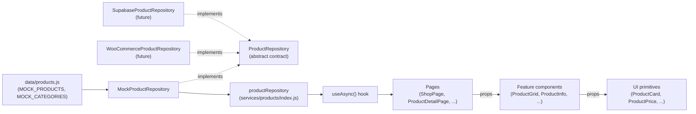
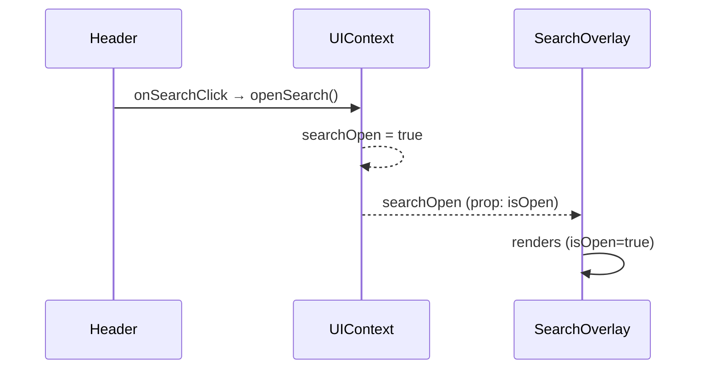
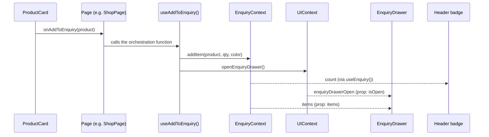

# Architecture

Long-term architectural reference for the Tupperware Exclusive Store React
rebuild. Describes the target architecture as of Milestone 5 (the Context
refactor agreed in conversation but **not yet implemented** — this document
is the reference the implementation is built against, not a description of
code that exists yet where `contexts/` is concerned).

---

## 1. Overall Application Architecture

The application is a layered, unidirectional-dependency system. Every layer
may depend on the layers below it; nothing below depends on anything above
it. This is what makes each layer independently testable and replaceable.

**The rule that matters most:** `features/*` and `components/*` never import
`contexts/`, `services/`, or `react-router-dom`. A `ProductCard` or
`EnquiryDrawer` has no idea Context exists, no idea a repository exists, no
idea what route it's rendered on. It receives data and callbacks as props
and renders. This is why Milestones 1–3 could build and verify every
component in isolation (`DesignSystemShowcase`) with hand-written mock
props, and why none of those components need to change now that Context is
being introduced above them — only `pages/` and `App.jsx` (which sit above
`features/` in the dependency graph) change.

---

## 2. Context Responsibilities

Two contexts, each owning exactly one kind of state, with **no dependency
on each other** (see §5).

### `EnquiryContext`
Owns the enquiry list and nothing else.

| Exposes | Kind |
|---|---|
| `items` | the enquiry list |
| `ids` | derived — `items.map(i => i.id)` |
| `count` | derived — sum of `qty` across items |
| `addItem(product, qty, color)` | pure state mutation — merges into an existing line item or appends a new one |
| `incrementItem(item)` / `decrementItem(item)` | qty mutation, floor of 1 |
| `removeItem(item)` | removes a line item |

`addItem` does **not** open the enquiry drawer. That used to be baked in;
it's been deliberately pulled out (§6).

### `UIContext`
Owns transient visibility/interaction state — nothing about products, carts,
or business data.

| Exposes | Kind |
|---|---|
| `mobileMenuOpen` / `toggleMobileMenu` / `closeMobileMenu` | Header's mobile nav |
| `searchOpen` / `openSearch` / `closeSearch` | SearchOverlay visibility |
| `searchValue` / `setSearchValue` | SearchOverlay's input value |
| `enquiryDrawerOpen` / `openEnquiryDrawer` / `closeEnquiryDrawer` | EnquiryDrawer visibility |

Neither context imports the other. Provider nesting order in `App.jsx` is
therefore irrelevant — a concrete, checkable proof that they're actually
decoupled and not just organized into separate files.

---

## 3. Hook Responsibilities

`src/hooks/` holds cross-cutting logic that doesn't belong to any single
component — either because it's infrastructure (`useSEO`, `useAsync`) or
because it composes two independent pieces of state (`useAddToEnquiry`).

| Hook | Responsibility |
|---|---|
| `useSEO({title, description})` | Sets `document.title` and the meta description tag on mount, restores the previous values on unmount. Zero dependencies — no react-helmet-async was added, by design (see the project's stated minimal-dependency stack). |
| `useAsync(asyncFn, deps)` | Generic `{data, loading, error}` wrapper around a Promise-returning function. Exists specifically so every page calling `productRepository.*` doesn't hand-roll the same loading-state boilerplate six times. Not a cache — re-fetches on every `deps` change, same as a plain `useEffect` would. |
| `useAddToEnquiry()` | Orchestration layer, not state. See §6. |

`hooks/` is allowed to import `contexts/` and `services/`. `contexts/` and
`services/` do not import `hooks/` — dependencies point one direction only.

---

## 4. Why Contexts Are Intentionally Decoupled

Three concrete reasons, not just "it's cleaner":

1. **Independent reusability.** `UIContext` has no idea what an "enquiry" is
   — it could be lifted into a completely different project with no cart
   concept at all (a blog, a marketing site) and work unmodified.
   `EnquiryContext` has no idea a drawer or a mobile menu exists — it could
   back a completely different UI (e.g. a future admin dashboard listing
   enquiries) with zero changes.
2. **No hidden coupling to trace.** If `EnquiryContext` imported `UIContext`
   internally, a bug in "why did the drawer open" would require reading
   `EnquiryContext`'s source to discover the answer lives somewhere else
   entirely. With decoupled contexts, if the drawer opened, the only place
   that could have called `openEnquiryDrawer()` is `UIContext` itself or
   something that explicitly imported it — there's exactly one path to
   trace, not two contexts to cross-reference.
3. **Independent testability.** `EnquiryContext`'s merge/qty logic can be
   unit-tested with zero rendering, zero mock overlay/menu state. Same for
   `UIContext`'s open/close toggles.

The cost of decoupling is that *something* has to combine them when a
feature genuinely spans both — which is exactly what `useAddToEnquiry`
is for.

---

## 5. Why `useAddToEnquiry` Exists

"Add to enquiry" is a real cross-cutting concern: it's fundamentally an
`EnquiryContext` state change (append/merge a line item) that today also
has a `UIContext` side effect (open the drawer so the user sees it worked).
Three ways to solve that, and why two of them were rejected:

- **Reject: let `EnquiryContext` call into `UIContext`.** Solves it in one
  place, but destroys the independence described in §4 for the sake of one
  feature.
- **Reject: call both `addItem()` and `openEnquiryDrawer()` at every call
  site** (`ShopPage`, `ProductDetailPage`, `RelatedProducts`,
  `RecentlyViewed`, search results, ...). Keeps the contexts decoupled, but
  now the "add opens the drawer" behavior is duplicated at every call site
  and will eventually drift (someone adds a new "add to enquiry" button
  somewhere and forgets the second call).
- **Chosen: `useAddToEnquiry()`.** A thin hook that calls `useEnquiry()` and
  `useUI()` and returns one function combining both. This is the *only*
  place in the codebase allowed to know both contexts exist. Every call
  site gets the combined behavior automatically and identically. If the
  desired behavior on "add" ever changes (e.g. show a toast instead of
  opening the drawer, once a Toast component exists), exactly one function
  changes.

Anywhere in the app that only needs to *read* the enquiry list (a header
badge showing `count`, a product card showing whether it's already added)
calls `useEnquiry()` directly — there's no reason to route a pure read
through the orchestration hook.

---

## 6. Data Flow Diagram

How product data reaches the screen, and the exact seam where a real
backend replaces the mock one later.

The swap point is `services/products/index.js`'s single line,
`export const productRepository = new MockProductRepository()`. Every
consumer above it (`useAsync`, pages, features, UI) only ever talks to the
`productRepository` singleton — none of them import `MockProductRepository`
or `MOCK_PRODUCTS` directly (`ProductFilters`'s default-prop fallback is the
one intentional exception, documented in its own file). Replacing the mock
with a real backend is changing that one line plus writing the new
repository class — nothing downstream changes.

---

## 7. UI State Flow

`UIContext` is the single source of truth for "what's currently open."
Trigger → context action → context state → the same piece of chrome
re-renders because it reads that state.

The same shape applies to `mobileMenuOpen` (Header's toggle button ↔
`MobileMenu`) and `enquiryDrawerOpen` (Header's cart icon / the floating
button ↔ `EnquiryDrawer`). None of `Header`, `MobileMenu`, `SearchOverlay`,
or `EnquiryDrawer` know `UIContext` exists — `App.jsx`/`AppShell` reads
`useUI()` and passes the relevant slice down as plain props, exactly as it
does today with local `useState`. Only *where the state lives* changes.

---

## 8. Enquiry Flow

Pages wire `useAddToEnquiry()`'s return value as the `onAddToEnquiry` prop
anywhere a product can be added (`ProductGrid`, `ProductInfo`,
`RelatedProducts`, `RecentlyViewed`, `SearchResults`). Pages wire
`useEnquiry().ids`/`.count` directly (no orchestration needed) anywhere the
app only needs to *read* enquiry state.

---

## 9. Folder Responsibilities

| Folder | Responsibility | May import from | Must not import |
|---|---|---|---|
| `components/ui/` | Generic design-system primitives. Zero domain knowledge. | `utils/` | `contexts/`, `services/`, `features/`, `pages/`, `react-router-dom` |
| `components/layout/` | Site-shell primitives (Header, Footer, Nav, Drawer shells). Prop-driven. | `components/ui/`, `utils/` | `contexts/`, `services/`, `pages/` |
| `features/{home,shop,product,search,enquiry}/` | Domain-aware compositions of UI/Layout primitives. Still purely prop-driven — no Context, no repository, no routing. | `components/ui/`, `components/layout/`, `utils/` | `contexts/`, `services/`, `pages/` |
| `contexts/` | App-wide state: `EnquiryContext`, `UIContext`. Each independent of the other. | `react` only | Each other; `hooks/`, `services/`, `components/*` |
| `hooks/` | Cross-cutting logic: data-fetching (`useAsync`), SEO (`useSEO`), context orchestration (`useAddToEnquiry`). | `contexts/`, `services/`, `react` | `components/*` (hooks don't render) |
| `services/products/` | The `ProductRepository` contract + implementations. The only code allowed to know where product data actually comes from. | `data/` (mock impl only) | `components/*`, `features/*`, `pages/`, `contexts/` |
| `data/` | Mock content — products, categories, promotions, testimonials, reels, nav/footer copy. Will shrink as real backends cover more of it. | nothing | everything above it |
| `pages/` | Route-level composition. Consumes `contexts/`, `hooks/`, `services/`, and composes `features/`/`components/*`. Owns page-local state (filters, form fields). | everything | — (top of the graph) |

This table is the enforceable contract — a new component that imports
`contexts/` from inside `components/ui/` is a review flag, not a style
preference.

---

## 10. Future Extension Points

### WooCommerce / Supabase
No architectural change required — this is what the repository pattern in
§6 exists for. Add `WooCommerceProductRepository` or
`SupabaseProductRepository` implementing the same `ProductRepository`
contract (`getProducts`, `getFeaturedProducts`, `getCategories`,
`getProductById`, `getProductBySlug`, `getRelatedProducts`,
`searchProducts`), swap the one line in `services/products/index.js`. Every
page, hook, and component is already written against the contract, not the
mock.

**Not yet covered by the repository pattern:** hero slides, promotions,
testimonials, reels, why-us content, and nav/footer copy have no repository
— they're still plain `src/data/*` imports because no backend for
non-product marketing content exists. If/when one does, the same pattern
applies: define a contract, implement it against mock data first, swap the
implementation later.

### Wishlist
Mirror the Enquiry pattern exactly rather than inventing a new shape:
- `WishlistContext` — `items`/`ids`, `addItem`/`removeItem`, decoupled from
  `UIContext` exactly like `EnquiryContext` is.
- If adding to the wishlist should also trigger UI feedback (open a
  wishlist drawer, show a toast), add `useAddToWishlist()` following
  `useAddToEnquiry()`'s exact shape — don't couple `WishlistContext` to
  `UIContext` any more than `EnquiryContext` is.

### Recently Viewed
Currently local `useState` in `App.jsx` (`recentlyViewedIds`), explicitly
*not* a context — it didn't fit either `EnquiryContext` or `UIContext`'s
named responsibility when Milestone 5 was scoped, and only one page
(`ProductDetailPage`) reads it. Two future paths, either valid:
- **Promote to `RecentlyViewedContext`** if a second consumer appears (e.g.
  a "recently viewed" widget in the header or footer) — read-only state, no
  reason to route it through an orchestration hook the way Enquiry needed.
- **Add persistence** (localStorage) via a small wrapper hook once
  persistence is approved for this project — it's explicitly out of scope
  today ("No Local Storage" was a standing constraint through Milestones
  3–5), not forgotten.

### Session/auth-dependent state
Real user accounts, saved addresses, or order history would each likely
warrant their own context following the same independence rule — resist
the temptation to fold them into `EnquiryContext` just because they're both
"user-related." A `UserContext` should know nothing about enquiries, and
vice versa; an orchestration hook combines them if a feature genuinely
needs both (e.g. "submit enquiry as a logged-in user" attaching account
info to the WhatsApp message).
