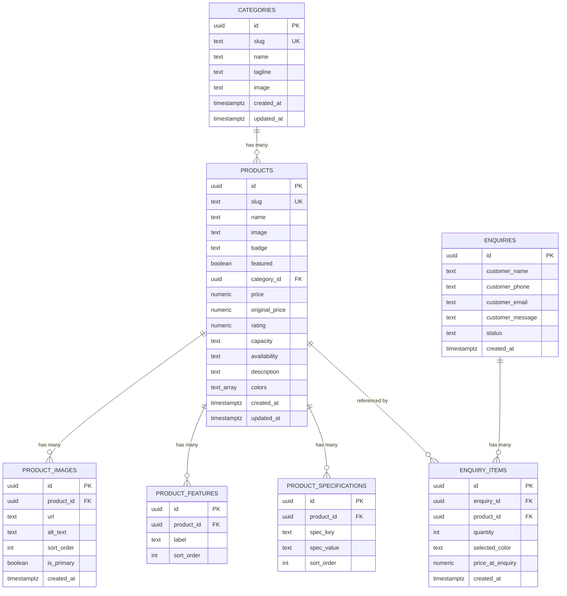

# Database Design — Tupperware Exclusive Store

Database architecture for the Supabase backend introduced in Milestone 7
(`ARCHITECTURE.md`, `services/products/SupabaseProductRepository.js`). This
document is the source of truth for the schema; `db/schema.sql` and
`db/seed.sql` are its executable form.

**Status:** design only. No React code changes. No auth, no admin panel —
the Supabase Dashboard is the temporary admin surface, per Milestone 7.

---

## 1. Database ER Diagram



Relationship summary (also see §10):
`categories 1─N products`, `products 1─N product_images`,
`products 1─N product_features`, `products 1─N product_specifications`,
`enquiries 1─N enquiry_items`, `products 1─N enquiry_items`.

---

## 2. `products` table

| Column | Type | Constraints |
|---|---|---|
| `id` | `uuid` | PK, default `gen_random_uuid()` |
| `slug` | `text` | `not null`, `unique` — URL-safe identifier, matches `getProductBySlug()` |
| `name` | `text` | `not null` |
| `image` | `text` | `not null` — primary/hero image; see `product_images` for gallery |
| `badge` | `text` | nullable — display-only label, e.g. "Best Seller" |
| `featured` | `boolean` | `not null default false` |
| `category_id` | `uuid` | `not null`, FK → `categories.id` |
| `price` | `numeric(10,2)` | `not null`, `check (price >= 0)` |
| `original_price` | `numeric(10,2)` | nullable, `check (original_price >= 0)` |
| `rating` | `numeric(2,1)` | `check (rating between 0 and 5)` |
| `capacity` | `text` | nullable, e.g. "1000 ml (Set of 4)" |
| `availability` | `text` | `not null default 'in_stock'`, `check` against a fixed set |
| `description` | `text` | nullable |
| `colors` | `text[]` | nullable — kept as a native array; not normalized (see §17) |
| `created_at` / `updated_at` | `timestamptz` | `not null default now()`, `updated_at` maintained by trigger |

`category_name` (present on the app's `Product` model today) is deliberately
**not** a column — it's derived from the `categories` join. See the
Integration Notes at the end of this document.

---

## 3. `categories` table

| Column | Type | Constraints |
|---|---|---|
| `id` | `uuid` | PK, default `gen_random_uuid()` |
| `slug` | `text` | `not null`, `unique` |
| `name` | `text` | `not null` |
| `tagline` | `text` | nullable |
| `image` | `text` | nullable |
| `created_at` / `updated_at` | `timestamptz` | as above |

---

## 4. `product_images` table (future-ready)

| Column | Type | Constraints |
|---|---|---|
| `id` | `uuid` | PK |
| `product_id` | `uuid` | `not null`, FK → `products.id`, `on delete cascade` |
| `url` | `text` | `not null` |
| `alt_text` | `text` | nullable |
| `sort_order` | `int` | `not null default 0` |
| `is_primary` | `boolean` | `not null default false` |
| `created_at` | `timestamptz` | `not null default now()` |

Not consumed by any repository method yet, but `features/product/ProductGallery.jsx`
already accepts an `images: string[]` prop — today it's called with
`[product.image]`. This table lets a future `getProductImages()` addition
light up a real gallery with zero UI changes.

---

## 5. `product_features` table (future-ready)

| Column | Type | Constraints |
|---|---|---|
| `id` | `uuid` | PK |
| `product_id` | `uuid` | `not null`, FK → `products.id`, `on delete cascade` |
| `label` | `text` | `not null` — e.g. "Microwave Safe", "BPA Free" |
| `sort_order` | `int` | `not null default 0` |

Normalizes today's `Product.features: string[]` so features can be queried,
reused across products, and reordered without rewriting an array column.

---

## 6. `product_specifications` table (future-ready)

| Column | Type | Constraints |
|---|---|---|
| `id` | `uuid` | PK |
| `product_id` | `uuid` | `not null`, FK → `products.id`, `on delete cascade` |
| `spec_key` | `text` | `not null` — e.g. "Material" |
| `spec_value` | `text` | `not null` — e.g. "Food-grade Polypropylene" |
| `sort_order` | `int` | `not null default 0` |
| — | — | `unique (product_id, spec_key)` |

Normalizes today's `Product.specs: Record<string,string>` (currently a
loose JSON shape) into queryable rows.

---

## 7. `enquiries` table

| Column | Type | Constraints |
|---|---|---|
| `id` | `uuid` | PK |
| `customer_name` | `text` | nullable |
| `customer_phone` | `text` | nullable |
| `customer_email` | `text` | nullable — added in Milestone 8 alongside the real submission flow |
| `customer_message` | `text` | nullable |
| `status` | `text` | `not null default 'new'`, `check (status in ('new','contacted','closed'))` |
| `created_at` | `timestamptz` | `not null default now()` |

As of Milestone 8, `EnquiryDrawer`'s submit flow (via `src/api/enquiryApi.js`)
writes one row here per submission — visible in the Dashboard, which is
standing in for an admin panel. `customer_name`/`customer_phone` are
required by the UI form even though nullable at the DB level (the column
stays nullable so the constraint lives in one place — the form validation —
rather than being duplicated as a `not null` check here).

---

## 8. `enquiry_items` table

| Column | Type | Constraints |
|---|---|---|
| `id` | `uuid` | PK |
| `enquiry_id` | `uuid` | `not null`, FK → `enquiries.id`, `on delete cascade` |
| `product_id` | `uuid` | `not null`, FK → `products.id`, `on delete restrict` |
| `quantity` | `int` | `not null`, `check (quantity > 0)` |
| `selected_color` | `text` | nullable |
| `price_at_enquiry` | `numeric(10,2)` | `not null` — price snapshot at submission time |
| `created_at` | `timestamptz` | `not null default now()` |

Mirrors the shape `EnquiryContext` already holds in memory (`id`, `qty`,
`selectedColor`) per item. `price_at_enquiry` is snapshotted rather than
joined live, so a later price change doesn't rewrite history for an already
submitted enquiry. `on delete restrict` on `product_id` (vs. `cascade` on
`product_images`/`features`/`specs`) is intentional — deleting a product
that appears in a past enquiry should fail loudly, not silently erase sales
history.

---

## 9. Recommended indexes

```sql
-- products
create index idx_products_category_id on products (category_id);
create index idx_products_featured    on products (featured) where featured = true;
create index idx_products_price       on products (price);
-- fast ILIKE '%term%' search (see extension note in schema.sql)
create index idx_products_name_trgm   on products using gin (name gin_trgm_ops);

-- categories: slug already indexed via its unique constraint

-- product_images / product_features / product_specifications
create index idx_product_images_product_id  on product_images (product_id);
create index idx_product_features_product_id on product_features (product_id);
create index idx_product_specs_product_id    on product_specifications (product_id);

-- enquiries
create index idx_enquiries_status     on enquiries (status);
create index idx_enquiries_created_at on enquiries (created_at desc);

-- enquiry_items
create index idx_enquiry_items_enquiry_id on enquiry_items (enquiry_id);
create index idx_enquiry_items_product_id on enquiry_items (product_id);
```

`slug` (products, categories) and the `(product_id, spec_key)` pair on
`product_specifications` already get indexes automatically from their
`unique` constraints — not repeated above.

---

## 10. Foreign key relationships

| Child table | FK column | Parent table | On delete |
|---|---|---|---|
| `products` | `category_id` | `categories.id` | `restrict` — can't delete a category that still has products |
| `product_images` | `product_id` | `products.id` | `cascade` — gallery images are meaningless without the product |
| `product_features` | `product_id` | `products.id` | `cascade` |
| `product_specifications` | `product_id` | `products.id` | `cascade` |
| `enquiry_items` | `enquiry_id` | `enquiries.id` | `cascade` — items are meaningless without their parent enquiry |
| `enquiry_items` | `product_id` | `products.id` | `restrict` — preserve historical enquiry data even if the product is later removed |

---

## 11. Row Level Security (RLS) policies

RLS is enabled on **every** table. With no authentication, all client
traffic reaches Supabase as the `anon` role, so `anon`'s policies are the
entire access surface until auth exists.

Overall model: **catalog data is publicly readable; enquiry data is
write-only from the client.** Nothing is publicly updatable or deletable —
those actions are left to the Dashboard (service-role) until an admin panel
exists.

```sql
alter table categories              enable row level security;
alter table products                enable row level security;
alter table product_images          enable row level security;
alter table product_features        enable row level security;
alter table product_specifications  enable row level security;
alter table enquiries               enable row level security;
alter table enquiry_items           enable row level security;
```

---

## 12. Public read policy for products (and the rest of the catalog)

```sql
create policy "Public read access" on categories
  for select to anon using (true);

create policy "Public read access" on products
  for select to anon using (true);

create policy "Public read access" on product_images
  for select to anon using (true);

create policy "Public read access" on product_features
  for select to anon using (true);

create policy "Public read access" on product_specifications
  for select to anon using (true);
```

No insert/update/delete policy is created for `anon` on any catalog table —
absence of a policy denies the action by default under RLS, so the catalog
is read-only from the client without an explicit "deny" rule.

---

## 13. Insert policy for enquiries

```sql
create policy "Public insert access" on enquiries
  for insert to anon with check (true);

create policy "Public insert access" on enquiry_items
  for insert to anon with check (true);
```

No `select`/`update`/`delete` policy exists for `anon` on `enquiries` or
`enquiry_items` — a customer can submit an enquiry but can't read anyone
else's (or even their own, back). Only the Dashboard (service-role,
bypasses RLS) can view submitted enquiries, matching "Supabase Dashboard
acts as the temporary admin panel."

**Integration note for the next milestone:** Supabase's client returns the
inserted row via `.insert(...).select()` by default in `supabase-js` v2,
which requires a `select` grant on the just-inserted row — but there is
none here by design. When enquiry submission is wired up, the insert call
must use `.insert(...)` **without** `.select()` (default `returning=minimal`),
or a narrowly scoped `select` policy will need to be added. This is a common
Supabase RLS pitfall and is called out here so it isn't rediscovered the
hard way later.

---

## 14. SQL schema.sql

See [`db/schema.sql`](db/schema.sql) — full DDL: extensions, all 7 tables,
constraints, indexes, `updated_at` triggers, RLS enable statements, and all
policies from §11–§13 in one idempotent, ordered script.

---

## 15. SQL seed.sql

See [`db/seed.sql`](db/seed.sql) — sample categories, products (with
images/features/specs), and one sample enquiry with items, matching the
shape and rough content of the existing `src/data/*.js` mock data so the
Supabase-backed app renders comparably to the mock-backed one during
verification.

---

## 16. Sample records

A representative slice (full set is in `db/seed.sql`):

**categories**
| slug | name | tagline |
|---|---|---|
| `kitchen-storage` | Kitchen Storage | Airtight freshness, every day |
| `bottles-sippers` | Bottles & Sippers | Hydration that travels well |

**products**
| slug | name | category | price | featured |
|---|---|---|---|---|
| `classic-airtight-container-set` | Classic Airtight Container Set | Kitchen Storage | 1150.00 | true |
| `eco-bottle-1l` | Eco Bottle 1L | Bottles & Sippers | 450.00 | false |

**product_specifications** (for `classic-airtight-container-set`)
| spec_key | spec_value |
|---|---|
| Material | Food-grade Polypropylene |
| Set Size | 4 pieces |

**enquiries** / **enquiry_items**: one sample enquiry (`status = 'new'`)
containing one `enquiry_items` row referencing
`classic-airtight-container-set`, quantity 2.

---

## 17. Why each table exists

- **`categories`** — the stable grouping products are browsed/filtered by
  (`ShopPage`'s category filter, `CategoryCarousel`). One row per catalog
  category; kept separate from `products` so a category's name/image can be
  edited once and reflected everywhere it's referenced.
- **`products`** — the core catalog entity; every page in the app
  (`HomePage`, `ShopPage`, `ProductDetailPage`, search, enquiry) ultimately
  reads from here via `ProductRepository`.
- **`product_images`** — decouples "how many images a product has" from the
  `products` row itself. A product's gallery can grow to 5 images or shrink
  to 1 without a schema change, and `ProductGallery.jsx` is already built
  to accept more than one.
- **`product_features`** — decouples the feature list from `products` so
  features are individually queryable/reorderable rows instead of an opaque
  array, and so future features (e.g. filtering "show only BPA-free
  products") don't require parsing an array column.
- **`product_specifications`** — same reasoning as features, applied to the
  key/value spec sheet (`Material`, `Capacity`, `Set Size`, ...): normalized
  rows instead of a loosely-typed JSON blob, with a `unique` constraint
  preventing duplicate spec keys per product.
- **`enquiries`** — the durable record of a customer's WhatsApp enquiry.
  Today the drawer forgets everything the moment the browser tab closes;
  this table is what lets the store owner see enquiry history in the
  Dashboard even before an admin panel exists.
- **`enquiry_items`** — the line items of an enquiry (which products, what
  quantity, what color, at what price). Separated from `enquiries` because
  an enquiry is 1-to-many with products — exactly the same
  header/line-item shape as `EnquiryContext` already uses in memory.

---

## Integration notes (for the milestone that wires this up — not done here)

- `products.category_id` (this schema) vs. `products.category` (assumed by
  today's `api/productApi.js`/`productMapper.js`) — the API layer's
  `.eq('category', ...)` filters and the mapper's `category: row.category`
  will need to target `category_id` when this schema is connected.
- `category_name` is not a column here — it must come from a join
  (`select('*, categories(name)')`) or a view; the mapper will need a small
  update to read it from the joined shape instead of a flat column.
- Enquiry submission (`EnquiryDrawer`'s `onSubmit`) still only opens a
  WhatsApp link today — persisting to `enquiries`/`enquiry_items` is new
  application logic, not covered by this milestone.

None of the above changes any code now — flagged so the next milestone's
scope is unambiguous.
